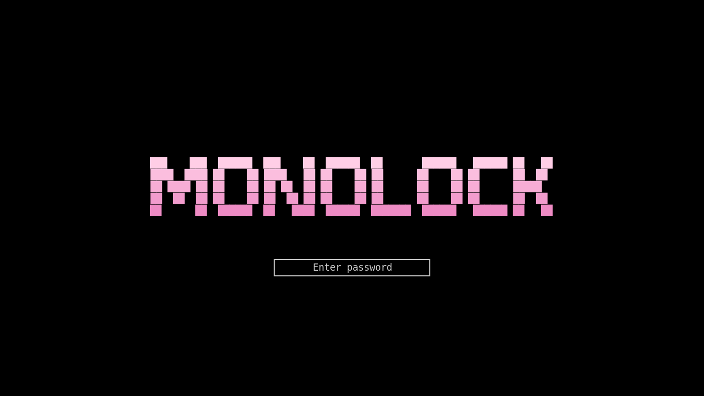

# monolock

**monolock** is a minimal and highly customizable screen locker for X11, inspired by the Unix philosophy. It turns your lock screen into a piece of art by displaying custom ASCII/Unicode art.




- [Features](#features)
- [Installation](#installation)
  - [Dependencies](#dependencies)
  - [Building from Source](#building-from-source)
- [Initial Setup](#initial-setup)
- [Usage](#usage)
- [Configuration](#configuration)
- [Future features](#future-features)


## Features

*   **Fully Customizable:** Change fonts, colors, ASCII art, and more through a simple INI configuration file.
*   **Full Unicode Support:** Display any art, whether it's classic ASCII, box-drawing characters, or even Braille patterns and emojis.
*   **Gradient Colors:** Set a start and end color to create a beautiful vertical gradient for your art.
*   **Multi-Monitor Support:** Correctly locks all screens and displays the UI on the monitor where the cursor is located.
*   **PAM Authentication:** Uses Linux's standard Pluggable Authentication Modules (PAM) for secure password verification.
*   **Minimal & Lightweight:** Written in C++ using Xlib/Xft for the lowest possible resource consumption.

## Installation

### Dependencies

To build and run `monolock`, you will need the following libraries. Ensure you have their development versions (`-dev` or `-devel`) installed.

*   `x11` (libX11)
*   `xft` (libXft)
*   `xinerama` (libXinerama)
*   `fontconfig`
*   `pam` (libpam)

**On Arch Linux:**
```bash
sudo pacman -S base-devel cmake pkgconf libx11 libxft libxinerama fontconfig pam
```

**On Debian/Ubuntu:**
```bash
sudo apt install build-essential cmake pkg-config libx11-dev libxft-dev libxinerama-dev libfontconfig1-dev libpam0g-dev
```

### Building from Source

The project uses CMake for building.

1.  **Clone the repository:**
    ```bash
    git clone https://github.com/icedagger101/monolock.git
    cd monolock
    ```

2.  **Create a build directory:**
    ```bash
    mkdir build && cd build
    ```

3.  **Configure and build the project:**
    ```bash
    cmake ..
    make
    ```

4.  **(Optional) Install the executable:**
    ```bash
    sudo make install
    ```
    This will copy the `monolock` binary to `/usr/local/bin`.

## Initial Setup

After building the project, you need to create the default configuration file.

1.  **Run the initialization script:**
    From the root directory of the project, run:
    ```bash
    chmod +x config_init.sh
    ./config_init.sh
    ```
    This script will create the `~/.config/monolock` directory and place a `config.ini` and `default_ascii.txt` inside it.

2.  **Customize your configuration:**
    Open `~/.config/monolock/config.ini` in your favorite text editor to personalize your lock screen. You can change fonts, colors, and the path to your ASCII art file.

## Usage

To lock your screen, simply run the executable:
```bash
monolock
```

### Integration with `xss-lock`

For automatic screen locking on inactivity or when closing a laptop lid, it is recommended to use `monolock` with a tool like `xss-lock`.

**Example usage with `i3wm`:**
Add the following line to your `~/.config/i3/config`:
```
exec --no-startup-id xss-lock --transfer-sleep-lock -- monolock --nofork
```

## Configuration

All settings are located in `~/.config/monolock/config.ini`.

| Key                 | Description                                                                                             | Example                   |
|---------------------|---------------------------------------------------------------------------------------------------------|---------------------------|
| `font`              | Fonts in Xft format. The system will automatically find fallback fonts for missing characters.            | `Terminus:size=14`        |
| `text_color`        | Default color for text, cursor, and input box border.                                                   | `#cccccc`                 |
| `box_color`         | Fill color for the password input box.                                                                  | `#000000`                 |
| `error_color`       | Border color on a wrong password attempt.                                                               | `#ff3333`                 |
| `password_char`     | The character used to mask the password.                                                                | `*`                       |
| `background_color`  | The background color for the entire screen.                                                             | `#000000`                 |
| `ascii_file`        | **Full absolute path** to your ASCII art file.                                                          | `/home/user/art/my_art.txt` |
| `ascii_color_start` | The starting (top) color of the gradient for the art.                                                   | `#FFCEE6`                 |
| `ascii_color_end`   | The ending (bottom) color of the gradient.                                                              | `#E56AB3`                 |
| `ascii_color`       | A solid color for the art (used if gradient colors are not set).                                        | `#ffffff`                 |

---

## Future features

- Auto mute sound when locking option
- Hide notifications option
- UI config